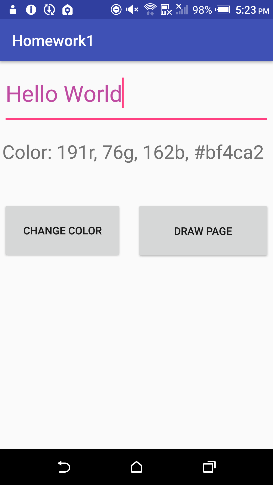
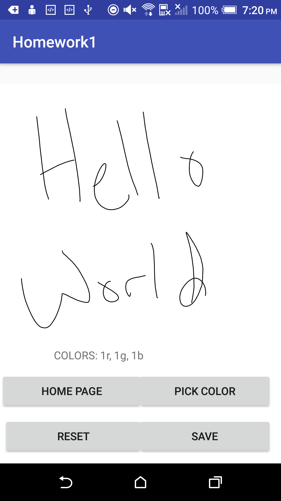
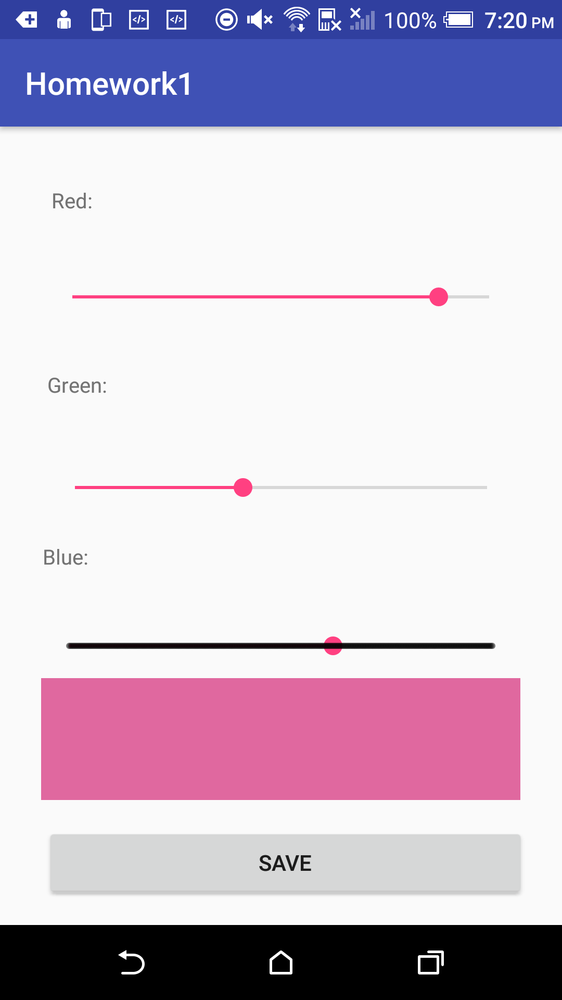
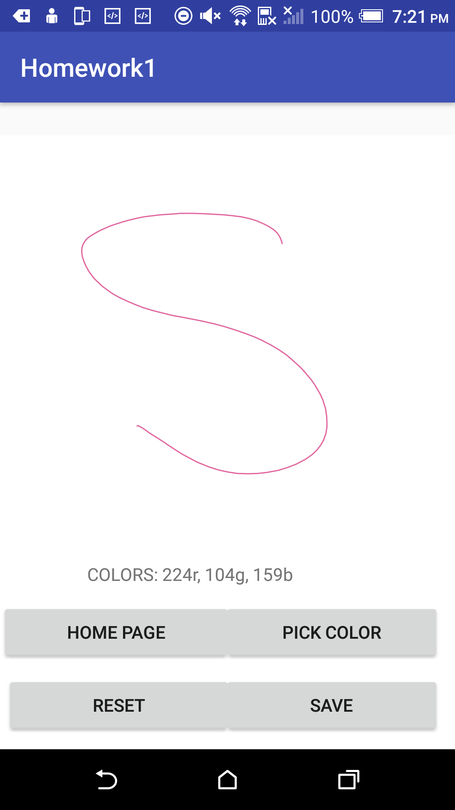

# DrawingApplication

This project has two main functionalities: 

Takes user inputted values, and when a button is pressed changes the color of the text. 

It also gives the user a DrawView (supplied by Byox on <a href="https://github.com/ByoxCode/DrawView">this</a> link) and gives the user options to choose a custom color and draw in that color.

# Functionality Information
This is an Android Application running on Android Studio written in Java. This application only runs on Android devices and is written with Android 6.0 (Marshamllow) in mind.

<h4>Home Page:</h4><br> 


The text field takes user input and when the "Change Color" button is pressed changes the Text Color of the input. Note that more specific information about the random color is displayed right below, showing the individual RGB values as well as the Hexidecimal value of the color.

<h4>Drawing:</h4><br>


All of the whitespace is available to draw on. Below are the buttons that allow you to navigate back to the home page (Home Page), clearing the drawing field (Reset), saving the work you have done to your device (Save) and finally picking a color that you can draw with through the Color Picker Page.
<br>

<h4>Color Picker Page:</h4>
<br>

<br>
The Red, Green and Blue SeekBars will allow you to create your own color, and give you a preview of the color below. By pressing the "Save" button, the color will be saved and redirect you to the draw page and future drawing will be done in your selected color.
<br>



# Getting Started

<h2>Prerequisites</h2>
Need to install the DrawView library:

<h3>Option 1:</h3>
<h4>Using Gradle</h4>

```
implementation 'com.byox.drawview:drawview:1.3.1'
```
Add this to your gradle.settings file in your Android Studio Project.

<h3>Option 2:</h3>
<h4>Add as dependency</h4>
<ol>
  <li>Download GitHub Project <a href="https://github.com/ByoxCode/DrawView">here</a></li>
  <li>Create New Folder In Project Root named libraries</li>
  <li>Drag Downloaded File Into new File</li>
  <li>In Android Studio: Right click your project in your Project view</li>
  <li>Open Module -> Dependencies -> Add Dependency drag file from libraries folder into new window</li>
</ol>

# Design

The design of this application was to have each part closely interacting with one another. Taking a look at the Draw and Color Picker pages, the user will create a color, and once the "Save" button is pressed will send the Draw Page the RGB colors and set the draw color to the user selected value. 

Each class is associated with a page, and is the sole class responsible for the functionality. For example in the Home Page, only the activity associated with it is responsible for the functionality of the page. There are not any other classes that contain functional dependence.

My thinking of doing this approach was: Make all the functionality of each page present to the user in a single class to make it easier to read and follow what was going on.

# Author
Logan Krause - Wright State University Student.

# Acknowledgments 
ByoxCode - DrawView <a href="https://github.com/ByoxCode/DrawView">Source</a> - Library Responsible for creating the DrawView.
